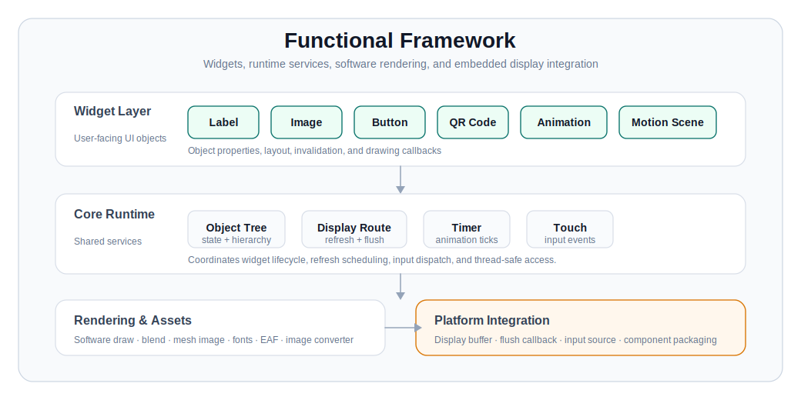

   

<h1 align="center">ESP Emote GFX</h1>

  面向嵌入式小屏设备的轻量 UI 图形库
   
  Widgets · Text · Images · QR Codes · Animation · Motion Scenes
   
   

  
  
  

  
  
  

  <a href="https://espressif2022.github.io/esp_emote_gfx/zh_CN/index.html">中文文档</a> |
  <a href="https://espressif2022.github.io/esp_emote_gfx/en/index.html">English Docs</a> |
  <a href="https://components.espressif.com/components/espressif2022/esp_emote_gfx">Component Registry</a>

---

  <strong>把嵌入式小屏 UI 里常见的显示对象、图像、文本、动画、二维码和 Motion 场景，收进一套轻量图形库。</strong>

  适合资源受限但仍需要流畅动效、清晰文字和轻量交互的小屏产品。

## 功能框架

  

## 模块说明

<table>
  <tr>
    <td width="33%">
      <strong>基础控件</strong>
       
      提供图片、文本、按钮、二维码、动画和 Motion 场景等常用 UI 元素。
    </td>
    <td width="33%">
      <strong>渲染与图像</strong>
       
      覆盖软件绘制、图像资源、RGB565 / RGB565A8 数据，以及基于控制点的 mesh image 形变。
    </td>
    <td width="33%">
      <strong>文本与字体</strong>
       
      支持 LVGL bitmap font 和 FreeType TTF/OTF 字体渲染。
    </td>
  </tr>
  <tr>
    <td width="33%">
      <strong>动画播放</strong>
       
      负责 EAF 播放、分段控制、循环模式，以及 timer-driven 的状态更新。
    </td>
    <td width="33%">
      <strong>Motion 场景</strong>
       
      面向路径驱动的角色、表情和交互动效，支持生成式 asset、pose/action 切换和颜色/纹理绑定。
    </td>
    <td width="33%">
      <strong>嵌入式集成</strong>
       
      作为组件接入工程，连接显示刷新、输入、内存 buffer 和线程安全对象访问。
    </td>
  </tr>
</table>

## 文档

详细安装、API、示例、Motion 架构和测试工程说明都放在在线文档里：

- 中文文档：<https://espressif2022.github.io/esp_emote_gfx/zh_CN/index.html>
- English docs: <https://espressif2022.github.io/esp_emote_gfx/en/index.html>
- Component Registry: <https://components.espressif.com/components/espressif2022/esp_emote_gfx>

## English

ESP Emote GFX is a lightweight software-rendered graphics library for compact embedded displays that need expressive UI elements without pulling in a heavy graphics stack.

For installation, API references, examples, and motion architecture notes, please visit the online documentation:

- Documentation: <https://espressif2022.github.io/esp_emote_gfx/en/index.html>
- Component Registry: <https://components.espressif.com/components/espressif2022/esp_emote_gfx>

## License

ESP Emote GFX is licensed under the Apache License 2.0. See [LICENSE](LICENSE).
